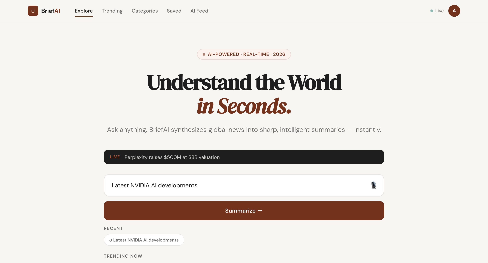

# BriefAI — AI-Powered News Summarization Platform

> Understand the world in seconds. BriefAI synthesizes global news into sharp, intelligent summaries — instantly.

---

## Overview

BriefAI is a premium AI news summarization web app built for 2026. Users ask any question about current events — politics, finance, sports, technology, science, startups, or entertainment — and the platform returns a structured, editorial-quality summary.

The frontend is a standalone React application. The AI backend is handled separately in Python.

---

## Features

- **AI-powered summaries** — Real-time summaries via Anthropic Claude Sonnet, returning structured JSON with headline, bullets, sentiment, deep dive, and sources
- **Voice input** — Web Speech API integration for hands-free querying
- **Trending dashboard** — Live-updating feed of top stories across 8 categories
- **Typewriter animation** — Token-by-token reveal of AI-generated content
- **Skeleton loading states** — Shimmer placeholders while the AI processes
- **Bookmark & share** — Save summaries and share links
- **Deep Dive expansion** — Collapsible contextual analysis section per summary
- **Recent history** — Quick-access chips for previous queries
- **Category filtering** — Filter trending feed by Global, Politics, Finance, Tech, Sports, Science, Startups, Entertainment
- **Responsive layout** — Designed for MacBook, iPad, iPhone, and Android

---

## Tech Stack

| Layer | Technology |
|---|---|
| Framework | React 18 (functional components + hooks) |
| Fonts | DM Serif Display, DM Sans (Google Fonts) |
| AI Model | Mistral AI |
| Voice Input | Web Speech API (`SpeechRecognition`) |
| Styling | Inline CSS with CSS variables, no external CSS framework |
| Build | Vite (recommended) or any React bundler |
| Backend | Python (FastAPI) |

---
# Getting Started

## Prerequisites
- Python 3+
- pip installed

---

## Clone the Repository

```bash
git clone https://github.com/your-org/briefai.git
cd briefai
```

---

## Backend Setup

```bash
cd backend

# Create virtual environment
python3 -m venv venv

# Activate virtual environment
source venv/bin/activate

# Install dependencies
pip install -r requirements.txt
```

### Run Backend

```bash
python3 -m uvicorn newssummariser:app --port 8000 --reload
```

Backend runs on:

```bash
http://localhost:8000
```

---

## Frontend Setup

Open a new terminal:

```bash
cd frontend
npm install
```

### Run Frontend

```bash
npm run dev
```

Frontend runs on:

```bash
http://localhost:5174
```

## API Integration

BriefAI calls the Anthropic Messages API directly from the browser during development. In production, route this through your Python backend to keep the API key server-side.


<p align="center">  </p>


## License

MIT © 2026 BriefAI
